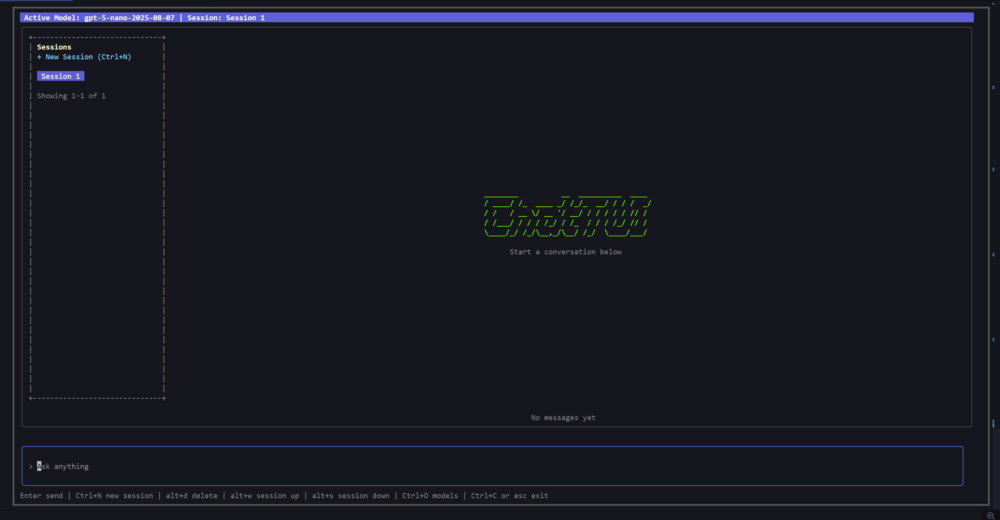

ChatTUI is a terminal-based chat client for OpenAI models, built with Go and Bubble Tea, with local SQLite persistence for chat sessions and message history.


## ✨ Key Features

- Terminal-first chat UI built with `bubbletea`, `bubbles`, and `lipgloss`.
- OpenAI chat integration with selectable models.
- Session sidebar with keyboard navigation.
- Create and delete chat sessions from the UI.
- Persistent chat history using local SQLite (`chat.db`).
- API key setup flow (load from environment or paste manually at startup).

## 🚀 How to Use

### 1) 📥 Clone the repository

```bash
git clone https://github.com/<your-username>/ChatTUI.git
cd ChatTUI
```

### 2) 📦 Install dependencies

```bash
go mod download
```

### 3) 🔐 Configure your OpenAI API key

Option A (recommended):

```bash
export API_KEY="your-openai-api-key"
```

If you use `direnv`, you can add this to your `.envrc`:

```bash
export API_KEY="your-openai-api-key"
```

Then run:

```bash
direnv allow
```

Option B:
- Launch the app and choose manual API key entry in the setup screen.

### 4) 🛠️ Build

```bash
go build -o ChatTUI ./cmd/app
```

### 5) ▶️ Run

```bash
./ChatTUI
```

## ⌨️ Controls

- `Enter`: send message
- `Ctrl+N`: create new session
- `Alt+W` / `Alt+S`: navigate sessions
- `Alt+D`: delete selected session (with confirmation)
- `Ctrl+O`: open model picker
- `Esc` or `Ctrl+C`: exit

## 📝 Notes

- Currently only text generation is supported, no images or videos.
- On startup, ChatTUI initializes/migrates the local SQLite database automatically.
- Chat sessions and messages are stored in `chat.db` in the project directory.
